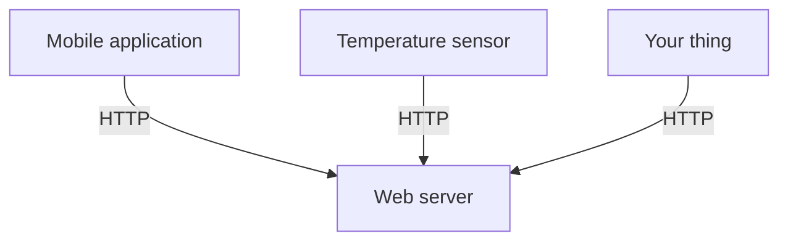

<!--
SPDX-FileCopyrightText: 2025 Benoît Rolandeau <benoit.rolandeau@allcircuits.com>

SPDX-License-Identifier: MIT
-->

# Specification <!-- omit from toc -->

## Table of contents

- [Table of contents](#table-of-contents)
- [Presentation](#presentation)
- [Evolution and corrections](#evolution-and-corrections)
- [Description of needs](#description-of-needs)
  - [Mobile application](#mobile-application)
  - [Web server](#web-server)
  - [The temperature sensor](#the-temperature-sensor)
  - [The interfaces](#the-interfaces)
    - [Presentation](#presentation-1)
    - [Mobile application \<=\> the web server](#mobile-application--the-web-server)
    - [Things \<=\> the web server](#things--the-web-server)
- [Constraints and rules](#constraints-and-rules)
  - [Presentation](#presentation-2)
  - [General](#general)
  - [Documentation](#documentation)
  - [Mobile application](#mobile-application-1)
  - [Web server](#web-server-1)
  - [Things](#things)
    - [Temperature sensor](#temperature-sensor)
    - [Your thing](#your-thing)

## Presentation

You are working in a fictional company.

This company is a small design office which helps other companies to connect their products on the
internet.

One of your customers asked you to design and develop a complete IoT system. You will have to:

- create a mobile application
- create a web server (_to exchange and store the things data_)
- create "things", such as a temperature sensor

The mobile application will be used to:

- display the data retrieved from the things, and
- to send commands to the things.

The web server will be used to:

- gather the data from the things,
- store the data in a database, and
- send commands to the things.

The things will be used to:

- retrieve data from the environment, and
- execute commands sent by the mobile application.

You will have to:

- define the architecture of the system,
- use the communication protocols between the different parts of the system, and
- improve the data format exchanged between the different parts of the system.

## Evolution and corrections

The forked repositories may evolve during the project. Your teacher will inform you of the changes
made in the base repositories.

## Description of needs

### Mobile application

The description of the needs of the mobile application is available in the
[01-specification/01-mobile-app/README.md](01-mobile-app/README.md) file.

### Web server

The description of the needs of the web server is available in the
[01-specification/02-web-server/README.md](02-web-server/README.md) file.

### The temperature sensor

The description of the needs of the temperature sensor is available in the
[01-specification/03-temperature-sensor/README.md](03-temperature-sensor/README.md) file.

### The interfaces

#### Presentation

The interfaces are described with the OpenAPI specification. The OpenAPI specification is a standard
which allows to describe the API of a web server. The OpenAPI specification is a YAML file.

You can preview it in Visual Studio Code with the extension: `42crunch.vscode-openapi`. You can
also preview it by copy/paste its content on the
[Swagger editor Web page](https://editor.swagger.io/).

#### Mobile application <=> the web server

The description of the interface between the mobile application and the web server is available in
the [mobile_app-server-api.yaml](05-interfaces/01-mobile_app-server/mobile_app-server-api.yaml)
file.

#### Things <=> the web server

The description of the interface between the things and the web server is available in
the [things-server-api.yaml](05-interfaces/02-things-server/things-server-api.yaml) file.

## Constraints and rules

### Presentation

Your project must respect the following constraints and rules.

### General

- `RG1`: your code must be written in English.
- `RG2`: your documentation must be written in English.
- `RG3`: the Pull requests and the issues could be written in French.
- `RG4`: your code must be documented.
- `RG5`: your code must be versioned with Git, on GitHub.
- `RG6`: all the members of your group must contribute to the project.
- `RG7`: your project must be delivered on time: the deadline is set by your teacher.
- `RG8`: your project must be delivered with a presentation and a demonstration of the work done.
- `RG9`: when a person develop something, he must document the code himself.
- `RG10`: don't push directly on the `main` branch, you have to work on a branch and create a pull
  request.
- `RG11`: the pull request must be reviewed by another person than the one who wrote it.
- `RG12`: try to respect this workflow:
  - create an issue in the repository to describe the work to do,
  - create a branch from `main`,
  - work on your branch,
  - create a pull request to merge your branch on `main`,
  - ask for a review of your pull request,
  - merge your branch on `main`.
  - delete the branch and close the issue.
- `RG13`: all the applications must be written in Flutter.
- `RG14`: the GitHub actions must be ok before merging the pull request.
- `RG15`: the GitHub actions must be ok before delivering the project.
- ~~`RG16`: you must use SPDX license identifiers in your files.~~
- `RG17`: don't modify or delete the `.markdownlint.json` and `analysis_options.yaml` files. They
  are here to help you to write better code and documentation.
- `RG18`: don't modify or delete the existing actions in the `.github` folder. It contains the
  GitHub actions to check your code. You can add new actions if you need them.
- `RG19`: at the end of the project, you must deliver the project with a tag.
  - The tag must be linked to the commit used for the demonstration done in front of the teacher.
- `RG20`: the tag must be named: `v1.0.0`
- ~~`RG21`: all your repositories must be private.~~
- `RG22`: the teacher must have access to all your repositories (_linked to this project_).
- `RG23`: Each things must have a unique serial number: a thing serial number is formatted like
  this: `XX-ZZ-YYYYY` where:
  - `XX` is an unique code (_unique to your company_)
    - _To have an unique code ask one to your teacher._
  - `ZZ` is the type of the thing, which can be:
    - `TS`: for temperature sensor, or
    - `YT`: for your thing
  - `YYYYY` is a unique number (_unique for the company_).
    - Your are free to choose the number.
  - _For instance: a temperature sensor serial number could be `CA-TS-00001`._
- `RG24`: all your things must respect the defined API and so must be able to interact with the
  web server of the other companies.
- `RG25`: have only one class in each file, the only exception is for the `StatefulWidget` and its
  `State` class.

### Documentation

- `RD1`: the project documentation must be written in Markdown files.
- `RD2`: your project documentation repository must be forked from the
  [ESAIP lessons doc template](https://github.com/benoit-rolandeau-act/esaip-lessons-doc)
  - _If you can't access the template repository, ask your teacher to give you access to it._
- `RD3`: the documentation in the doc repository is also reviewed by another person than the one
  who wrote it.
- `RD4`: all your work stored on third parties services must be referenced in the documentation.
  - _For instance: uf you have created mockups on Figma, you must reference them in the
    documentation._
- `RD5`: your documentation repository must contain the general architecture of your project.
- `RD6`: your documentation repository must contain diagrams.

### Mobile application

- `RMA1`: the mobile application must be developed for Android or iOS platforms (_you choose_).
- `RMA2`: your mobile application repository must be forked from the
  [ESAIP lessons app template](https://github.com/benoit-rolandeau-act/esaip-lessons-app)
  - _If you can't access the template repository, ask your teacher to give you access to it._

### Web server

- `RWS1`: the web server must be developed for Windows, linux or macOS platforms (_you choose_).
- `RWS2`: your web server repository must be forked from the
  [ESAIP lessons server template](https://github.com/benoit-rolandeau-act/esaip-lessons-server)
  - _If you can't access the template repository, ask your teacher to give you access to it._
- `RWS3`: if you add new requests to the web server, you must document them in the documentation
  repository by updating the API documentation (the swagger file).
- `RWS4`: you can't update the existing API requests of the sensors without discussing it with the
  other companies. You can only do it if all the companies agree. In that case, you have to update
  the API of the sensors in the forked documentation repository.

### Things

#### Temperature sensor

- `RTS1`: the temperature sensor must be developed for Android, iOS, Windows, linux or macOS
  platforms (_you choose_).
- `RTS2`: your temperature sensor repository must be forked from the
  [ESAIP lessons app template](https://github.com/benoit-rolandeau-act/esaip-lessons-app)
  - _If you can't access the template repository, ask your teacher to give you access to it._
- `RTS3`: the temperature sensor must have HMI to display the temperature and simulate the
  environment (and to send data to the server).

#### Your thing

- `RYS1`: your thing must be developed for Android, iOS, Windows, linux or macOS platforms
  (_you choose_).
- `RYS2`: your thing repository must be forked from the
  [ESAIP lessons app template](https://github.com/benoit-rolandeau-act/esaip-lessons-app)
  - _If you can't access the template repository, ask your teacher to give you access to it._
- `RTS3`: your thing must be able to retrieve data from the server.
- `RTS4`: your thing must be able to push data to the server.
- `RTS5`: you must describe what you want for your thing in the specification folder:
  [01-specification/04-your-thing/README.md](04-your-thing/README.md)
